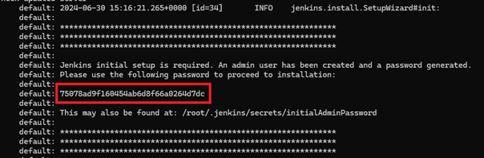
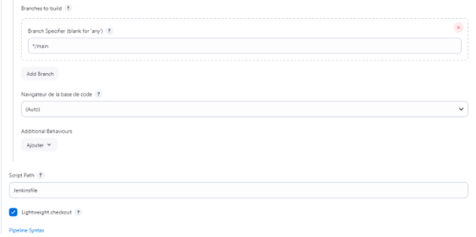

# Pipeline Setup Guide

This project is part of the **ST2DCD DevOps and Continuous Delivery 2023** course at [**Efrei Paris**](https://www.efrei.fr/programme-grande-ecole/le-cycle-ingenieur/ingenieur-software-engineering/).

## Objectives
1. **Master/Slave Configuration**: Configure Jenkins (or equivalent tool like Gitlab-CI) in such a way that when the master accepts a build request, the execution is started on one of the slave (agent) machines. The pipeline needs to include: build, unit test, deployment. 

2. **Build Notifications**: Once the Jenkins build is complete, whether it succeeded or failed, a notification is sent to the developers (Slack / Discord / ...). 

3. **Application Deployment**: The application is deployed to a final server that will contain only the application and nothing else.

## Prerequisites

- Vagrant installed on your machine
- VirtualBox installed on your machine (version 7.0.18)

## Step-by-Step Setup

### 1. Start Master with Vagrant

```bash
cd ./DevopsPipeline/Master
vagrant up
```

### 2. Copy Admin Password

Copy the admin password displayed in the console.



### 3. Set Up Jenkins

1. Open Jenkins in your browser at `http://localhost:8080`.

2. Paste the copied admin password.

3. Install suggested plugins.

4. Continue as the admin user.

### 4. Start VMs
  
#### Start Server VM:

```bash
cd ./DevopsPipeline/Server
vagrant up
```

#### Start Agent VM:

```bash
cd ./DevopsPipeline/Agent
vagrant up
```

### 5. Create and Configure Dockerfile

In the agent VM :

1. Edit the Docker service configuration:

```bash
sudo vi /lib/systemd/system/docker.service
```

2. Change the `ExecStart` line to:

```bash
ExecStart=/usr/bin/dockerd -H tcp://0.0.0.0:4243 -H unix:///var/run/docker.sock
```

3. Restart Docker services:

```bash
sudo systemctl daemon-reload
sudo service docker restart
```

4. Ensure the Docker API is working:

```bash
curl http://192.168.0.30:4243/version
```

### 6. Configure SSH Keys

1. Generate an SSH key:

```bash
ssh-keygen -t rsa -b 2048 -N ""
```

2. Copy the SSH key to the server VM:

```bash
ssh-copy-id -i ~/.ssh/id_rsa.pub vagrant@192.168.33.10
```

The password is `vagrant`.

### 7. Build Jenkins Slave Image

You can create a Dockerfile or use an existing image from Docker Hub or Git.

```bash
sudo git clone https://github.com/Kuhame/spring-petclinic.git
cd ./DevopsPipeline/Agent
sudo docker build -t laurenthan/slaveimage .
```
OR
```bash
sudo docker pull laurenthan/slaveimage
```

### 8. Configure Jenkins

1. Return to Jenkins admin interface.

2. Install the following plugins:

	- Docker

	- Discord Notifier

	- SSH Agent

	- Stage View

3. Restart Jenkins.

### 9. Create Jenkins Credentials

#### Create Cloud Credentials:

- Username: `Jenkins`

- Password: `Slave2020`


#### Create SSH Credentials:

1. Username with private key to connect via SSH to the app server.

2. ID should be `docker-agent`.

3. Copy the SSH private key from the agent VM:

```bash
cat ~/.ssh/id_rsa
```


### 10. Create a New Docker Cloud

1. Add a new Docker agent template in Jenkins.


### 11. Create a Pipeline Job

1. In Jenkins, create a new job.

2. Select "Pipeline" and configure the pipeline.




### 12. Start the build


You can now start the app in your browser at http://localhost:8090

### 12. Pipeline Demo


## Members

- Frédéric CASIER
- Nathan DELORME
- Mattis DESVILLES
- Julien DE LAHARPE
- Laurent HAN
- Pierre HE
- Matthieu JACQUES
- Alexandra WONYU
